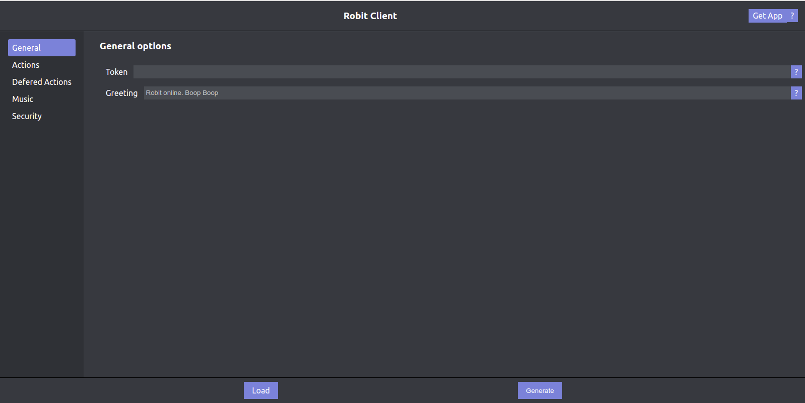

# About
Robitclient is a client companion for somerobit. This provides a relatively easy web UI to create JSON files for somerobit. When this application is hosted in electron it also allows you to manage your robit instance.

## Generating a token
For information on generating a bot token see this [page](https://github.com/JeffreyRiggle/somerobit/blob/master/doc/Installation.md).